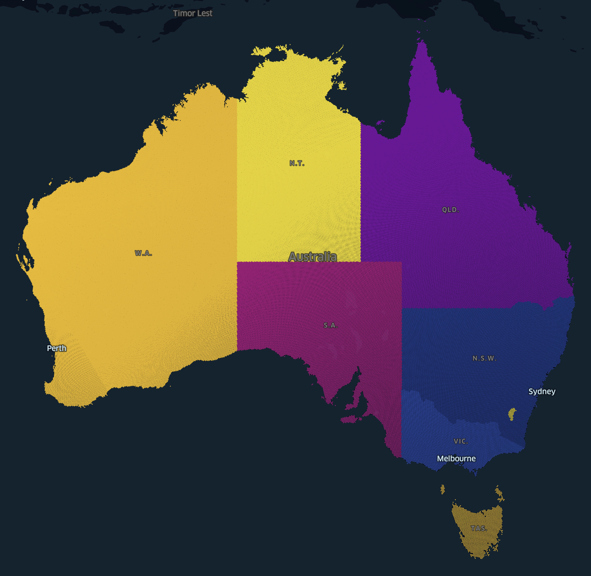
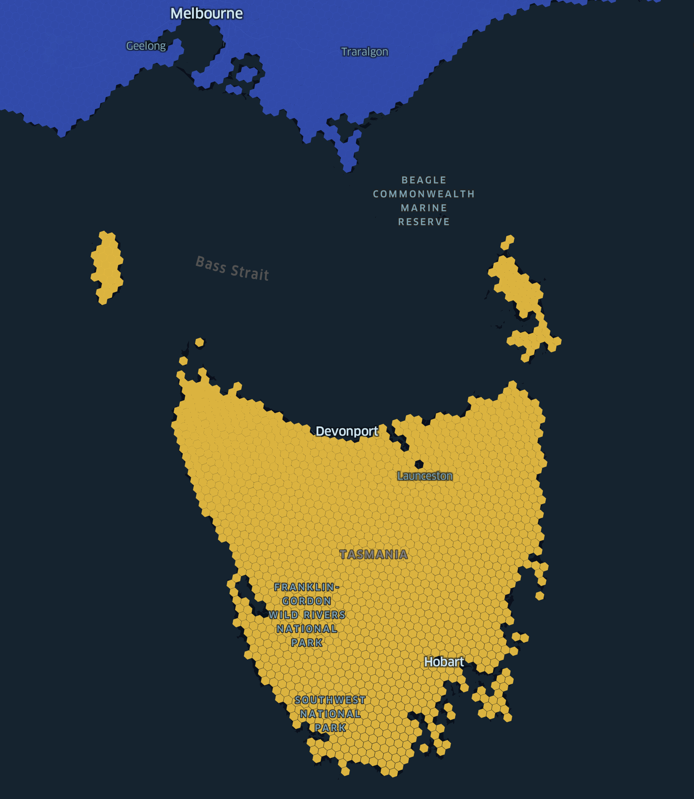

# Australian States & Territories with H3

Reverse geocode a lat/lon to a H3 res 6 hexagon and then find the state/territory using states.csv.

## Usage

```py
import csv
from h3 import latlng_to_cell

lookup = {}
with open("states.csv", "r", encoding="utf-8") as f:
    reader = csv.DictReader(f)
    for row in reader:
        lookup[row["cellId"]] = row["state"]

# Melbourne CBD lat/lng
lat = -37.814
lng = 144.96332
res = 6

# convert lat/lng to H3 cell
cell = latlng_to_cell(lat, lng, res)

# look up state
state = lookup[cell]

print(f"Melbourne CBD is in {state}")

## Melbourne CBD is in Victoria
```

To regenerate the states.csv file as at a different resolution update the RES value in main.py and run:

```sh
virtualenv venv
source venv/bin/activate
pip install -r requirements.txt
python main.py
```

## Visualisations using Kepler.gl




